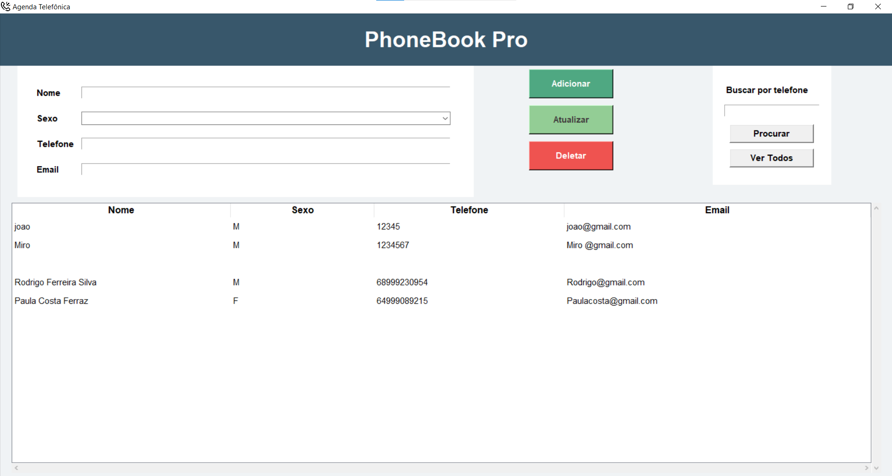

# 📞 PhoneBook Pro – Sistema de Gestão de Contatos


<p align="center">
  
</p>

---

## 📌 Sobre o Projeto
O **PhoneBook Pro** é uma aplicação desktop para gerenciamento de contatos telefônicos, desenvolvida com foco em simplicidade, organização e performance.  
O sistema utiliza **separação de camadas (UI e Dados)** e persistência em arquivos CSV, garantindo leveza, portabilidade e fácil manutenção.

---

## ✨ Funcionalidades
- ✅ **CRUD Completo:** cadastrar, visualizar, editar e remover contatos  
- 🔍 **Busca Inteligente:** filtro rápido por número de telefone  
- 💾 **Auto-Save:** dados salvos automaticamente no arquivo `dados.csv`  
- 🎨 **Interface Moderna:** layout em cards com feedback visual  
- 🛡️ **Tratamento de Erros:** validação de campos vazios e arquivos inexistentes  

---

## 🛠️ Tecnologias Utilizadas
- **Linguagem:** Python 3.10+  
- **Interface Gráfica:** Tkinter  
- **Persistência de Dados:** Módulo `csv` (nativo)  
- **Documentação:** Markdown

 ## 📘 Documentação
Para uma compreensão profunda da arquitetura e operação, consulte os manuais detalhados:

📄 Documentação Técnica: Explicação das funções, tratamento de dados e lógica CRUD.

👤 Manual do Usuário: Guia passo a passo para utilizar todas as ferramentas do sistema.

## 🚀 Melhorias Futuras
[ ] 🔎 Filtro Avançado: Implementar busca por Nome e Email.

[ ] 📤 Exportação: Gerar relatórios em formato PDF ou Excel.

[ ] 🔐 Segurança: Adicionar criptografia básica no arquivo CSV.

[ ] 🌙 Customização: Sistema de temas (Light/Dark Mode).

## 📄 Licença
Este projeto está sob a Licença MIT. Uso livre para fins educacionais e pessoais.

---
## ⚙️ Instalação e Execução
1. **Clone o repositório:**
   ```bash
   git clone [https://github.com/SEU_USUARIO/agenda-telefonica.git](https://github.com/SEU_USUARIO/agenda-telefonica.git)
